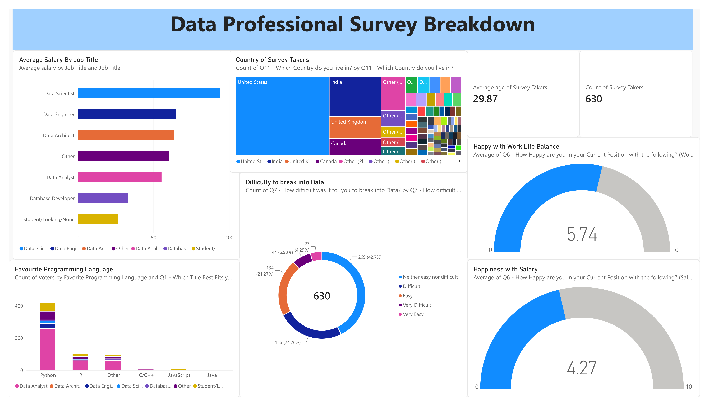

# 📊 Data Professional Survey Breakdown – Power BI Dashboard

[](https://powerbi.microsoft.com/)
[](https://www.microsoft.com/excel)
[](https://learn.microsoft.com/dax/)
[](Data-Professional-Survey.pdf)
[](https://opensource.org/licenses/MIT)

> An end-to-end interactive **Power BI Business Intelligence Dashboard** analyzing survey responses from 630+ data professionals worldwide. The dashboard surfaces critical industry insights into salaries, favorite programming languages, work-life balance, job satisfaction, career transitions, and industry demographics.

---

## 📸 Dashboard Preview



📄 **[📥 Download Full PDF Report (Data-Professional-Survey.pdf)](Data-Professional-Survey.pdf)**

---

## 📌 Table of Contents
- [Dashboard Preview](#-dashboard-preview)
- [Project Overview](#-project-overview)
- [Key Insights & Highlights](#-key-insights--highlights)
- [Dashboard Features & Architecture](#-dashboard-features--architecture)
- [Dataset Overview](#-dataset-overview)
- [Data Transformation & Modeling (Power Query / DAX)](#-data-transformation--modeling-power-query--dax)
- [Repository Structure](#-repository-structure)
- [Getting Started & Usage](#-getting-started--usage)
- [Author & Acknowledgments](#-author--acknowledgments)

---

## 🎯 Project Overview

The objective of this project is to clean, transform, and visualize real-world survey data from hundreds of global data professionals (Data Analysts, Data Engineers, Data Scientists, Business Analysts, and aspiring professionals). 

Using **Power Query** for data wrangling and **Power BI** for visual storytelling, this dashboard answers pivotal career questions:
- *What is the average compensation across different data roles?*
- *Which programming languages are most favored by practitioners?*
- *How difficult is it to break into the data industry today?*
- *How satisfied are data professionals with their salary, management, and work-life balance?*
- *What do professionals value most when pursuing a new job?*

---

## 💡 Key Insights & Highlights

- **Dominant Role:** **Data Analyst** represented the largest share of respondents (~60%), followed by aspiring professionals/students, Data Engineers, and Data Scientists.
- **Top Programming Language:** **Python** emerged as the undisputed favorite programming language, followed by **R** and **SQL**.
- **Salary Benchmarks:** Data Scientists and Data Engineers command the highest average compensation, followed by Data Architects and Senior Analysts.
- **Barrier to Entry:** Over **45%** of respondents noted that breaking into the data industry was either *Difficult* or *Very Difficult*, while ~43% found it neutral.
- **Job Priorities:** **Remote work availability** and **higher compensation** ranked as the primary motivators when seeking new career opportunities.
- **Demographics:** The average respondent age is **~30 years**, representing a global community across North America, Europe, Asia, and other regions.

---

## 🖥️ Dashboard Features & Architecture

```
+-----------------------------------------------------------------------------------+
|                            DATA PROFESSIONAL SURVEY DASHBOARD                     |
+-----------------------------------------------------------------------------------+
|  [ Total Respondents: 630 ]   [ Avg Age: 29.9 ]   [ Career Switchers: ~60% ]      |
+------------------------------------+----------------------------------------------+
|  💼 SALARY & DEMOGRAPHICS          |  🛠️ TECH STACK & TOOLS                      |
|  - Avg Salary by Job Role (Bar)   |  - Favorite Programming Language (Treemap/Bar)|
|  - Global Distribution by Country |  - Difficulty to Break into Data (Donut/Pie)  |
+------------------------------------+----------------------------------------------+
|  😊 HAPPINESS & SATISFACTION SCORES|  🎯 JOB PREFERENCES                          |
|  - Salary Satisfaction (Gauge)    |  - Most Important Factor in New Role         |
|  - Work/Life Balance (Gauge)      |  - Education & Career Background             |
+------------------------------------+----------------------------------------------+
```

### Key Visualizations & Elements:
1. **Summary KPI Cards:** Total Respondents, Average Age, and Survey Participation metrics.
2. **Salary Analysis by Role:** Bar charts comparing compensation ranges across titles.
3. **Tool & Language Preferences:** Visual breakdown of preferred tech stacks (Python, R, SQL, DAX).
4. **Sentiment & Happiness Gauges:** Quantifying satisfaction scores (Scale 1–10) across:
   - Salary & Compensation
   - Work-Life Balance
   - Coworkers & Culture
   - Management & Upward Mobility
   - Continuous Learning
5. **Interactive Slicers:** Dynamic filtering by Country, Role, Education Level, and Career Switch status.

---

## 📂 Dataset Overview

The dataset contains raw survey responses collected from 630 individuals across 28 survey parameters:

| Feature / Column Group | Description |
|---|---|
| **Demographics** | Age, Gender, Ethnicity, Country of Residence, Highest Level of Education |
| **Current Employment** | Job Title, Industry, Current Yearly Salary (in USD Ranges) |
| **Skillset & Stack** | Favorite Programming Language (Python, R, SQL, DAX, etc.) |
| **Sentiment & Ratings (1-10)** | Satisfaction with Salary, Work/Life Balance, Coworkers, Management, Learning |
| **Career Path** | Career switcher status, perceived difficulty breaking into data |
| **Future Outlook** | Most important factors considered when searching for a new job |

---

## ⚙️ Data Transformation & Modeling (Power Query / DAX)

### 🧹 Power Query Cleaning Steps:
1. **Column Splitting & Standardizing:**
   - Parsed salary ranges into normalized minimum/maximum bounds to compute standardized average salary metrics.
   - Standardized job titles and free-text inputs for roles (e.g., merging custom entries into standardized categories).
2. **Handling Missing Values:**
   - Addressed blank and null survey answers across education, ratings, and feedback fields.
3. **Data Type Correction:**
   - Ensured accurate numerical, text, and categorical typing across all columns.
4. **Custom Groupings:**
   - Consolidated country responses to group low-frequency countries into an "Other" category for clean geographic visualization.

### 📐 DAX Measures Implemented:
- **Total Respondents:** `COUNTROWS('Data Professional Survey')`
- **Average Age:** `AVERAGE('Data Professional Survey'[Age])`
- **Average Salary:** Custom calculated measures deriving mid-point estimations from salary brackets.
- **Average Satisfaction Ratings:** `AVERAGE()` measures for Salary, Work/Life Balance, and Culture scores.

---

## 📁 Repository Structure

```text
Data-Survey-Dashboard-PowerBI/
│
├── Data-Professional-Survey.pbix       # Completed interactive Power BI Report file
├── Data-Professional-Survey.pdf        # Exported High-Quality PDF Dashboard Report
├── dashboard_preview.png               # High-Resolution Dashboard Preview Image
├── Power BI - Final Project.xlsx       # Cleaned & processed Excel survey dataset
├── .gitignore                          # Git ignore configuration
└── README.md                           # Comprehensive project documentation
```

---

## 🚀 Getting Started & Usage

### Prerequisites
- [Microsoft Power BI Desktop](https://powerbi.microsoft.com/desktop/) (Free download)
- [Microsoft Excel](https://www.microsoft.com/excel) (Optional, for dataset inspection)
- [Adobe Acrobat Reader / PDF Viewer](https://get.adobe.com/reader/) (For viewing the PDF report)

### Steps to Run Locally:
1. **Clone this repository:**
   ```bash
   git clone https://github.com/Yashraj-18/Data-Survey-Dashboard-PowerBI.git
   ```
2. **Open the project:**
   - Launch **Power BI Desktop**.
   - Open [`Data-Professional-Survey.pbix`](Data-Professional-Survey.pbix).
   - Alternatively, view the exported report directly: [`Data-Professional-Survey.pdf`](Data-Professional-Survey.pdf).
3. **Explore the Dashboard:**
   - Use the interactive slicers and cross-filtering across visuals to discover custom insights.

---

## 👤 Author

**Yash Raj Jaiswal**
- **GitHub:** [@Yashraj-18](https://github.com/Yashraj-18)
- **Email:** [jaiswalyashraj18@gmail.com](mailto:jaiswalyashraj18@gmail.com)

---

## 📜 License

This project is licensed under the [MIT License](LICENSE) - feel free to use this project for reference and learning purposes.
